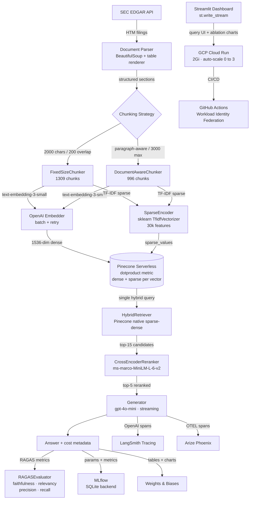

# RAG Evaluation & Observability Framework

> **Live demo:** [https://rag-eval-framework-clc6ju46dq-uc.a.run.app](https://rag-eval-framework-clc6ju46dq-uc.a.run.app)

A production-grade Retrieval-Augmented Generation system built on SEC 10-K filings (AAPL, MSFT, JPM). The project covers every layer of the RAG stack — ingestion through evaluation — with full observability and a 4-way ablation study backed by real RAGAS scores.

---

## Architecture



---

## Results — 6-Way Ablation Study

8 questions across AAPL, MSFT, JPM 10-K filings. Model: `gpt-4o-mini`. Retriever: Hybrid (Pinecone native sparse-dense).

| Run | Faithfulness | Answer Relevancy | Context Precision | Context Recall | Avg Cost/Query |
|-----|:-----------:|:----------------:|:-----------------:|:--------------:|:--------------:|
| fixed\_size · v1 | 0.977 | **0.996** | 0.661 | **0.594** | $0.000382 |
| fixed\_size · v2 | 0.895 | **0.996** | 0.782 | **0.594** | $0.000419 |
| document\_aware · v1 | **1.000** | 0.991 | 0.796 | 0.531 | $0.000501 |
| document\_aware · v2 | 0.854 | 0.992 | **0.877** | 0.531 | $0.000519 |
| fixed\_size · v1 · rerank | 0.844 | 0.871 | 0.745 | 0.500 | $0.000379 |
| document\_aware · v1 · rerank | 0.875 | **0.998** | 0.695 | **0.625** | $0.000462 |

**Key findings:**
- `document_aware + v1` achieves perfect faithfulness (1.000) — paragraph-aware chunks prevent mid-sentence splits that cause hallucination
- `document_aware + v2` wins context precision (0.877) — the citation instruction in v2 forces the model to draw only from the most relevant chunks
- `fixed_size` wins context recall (0.594 without reranker; 0.625 with) — smaller, denser chunks cast a wider net
- Cross-encoder reranking boosts recall (+0.094 on document\_aware) and answer relevancy (+0.007) but lowers faithfulness on fixed\_size, suggesting smaller chunks produce noisier top-5 after reranking
- Average cost per query is **$0.0004–$0.0005** — the full 8-question eval suite costs less than half a cent

---

## Stack

| Layer | Technology |
|-------|-----------|
| Ingestion | SEC EDGAR API, BeautifulSoup, custom HTML table renderer |
| Chunking | FixedSizeChunker (2000/200), DocumentAwareChunker (3000 max) |
| Embedding | OpenAI `text-embedding-3-small`, batch + exponential retry; streaming answers via `st.write_stream` |
| Vector store | Pinecone v9 serverless (AWS us-east-1, 1536-dim, dotproduct) |
| Sparse retrieval | TF-IDF via `sklearn.TfidfVectorizer` (30k features, sublinear tf) |
| Hybrid fusion | Pinecone native sparse-dense (single query, sparse\_weight=0.3) |
| Reranker | `cross-encoder/ms-marco-MiniLM-L-6-v2` via sentence-transformers |
| Generation | GPT-4o-mini with per-query cost tracking |
| Evaluation | RAGAS (faithfulness, answer\_relevancy, context\_precision, context\_recall) |
| Tracing | LangSmith (`wrap_openai`) |
| Experiment tracking | MLflow (SQLite) + Weights & Biases |
| Span observability | Arize Phoenix (OpenTelemetry) |
| Dashboard | Streamlit |
| Deployment | GCP Cloud Run (2Gi, 0-3 instances) |
| CI/CD | GitHub Actions + Workload Identity Federation (no service account keys) |

---

## Project Structure

```
rag-eval-framework/
├── src/
│   ├── ingestion/          # SEC EDGAR downloader, HTML parser, document registry
│   ├── chunking/           # FixedSizeChunker, DocumentAwareChunker
│   ├── embedding/          # OpenAI embedder, Pinecone VectorStore, SparseEncoder (TF-IDF)
│   ├── retrieval/          # VectorRetriever, HybridRetriever, CrossEncoderReranker
│   ├── generation/         # Generator (gpt-4o-mini), PromptManager (versioned)
│   ├── evaluation/         # RAGASEvaluator, test_questions.json
│   ├── observability/      # MLflowTracker, WandbTracker, PhoenixTracer
│   └── dashboard/          # Streamlit app
├── configs/config.yaml
├── prompts/                # v1 (concise), v2 (cite sources)
├── experiments/            # RAGAS results JSON per run
├── main.py                 # Experiment runner (--strategy, --prompt, --rerank)
├── Dockerfile
└── .github/workflows/deploy.yml
```

---

## Running Locally

```bash
git clone https://github.com/Dilipchennam3005/rag-eval-framework.git
cd rag-eval-framework
python -m venv venv && venv\Scripts\activate   # Windows
pip install -r requirements.txt
```

Create `.env`:
```
OPENAI_API_KEY=...
PINECONE_API_KEY=...
LANGCHAIN_API_KEY=...
WANDB_API_KEY=...
```

```bash
# Build index + run all 4 ablation experiments
python main.py

# With cross-encoder reranker
python main.py --rerank

# Dashboard (local, with hybrid retrieval enabled)
streamlit run src/dashboard/app.py
```

---

## Design Decisions

**Pinecone over ChromaDB**
ChromaDB stores the index on disk, which means the Docker image would need to bundle gigabytes of vector data and the container becomes stateful. Pinecone is cloud-hosted — the container stays stateless, scales to zero between requests with no cold-start penalty for the index. Trade-off: ~30ms network latency per query vs. microsecond local lookup.

**Workload Identity Federation over service account keys**
GCP org policy blocked service account key creation. WIF exchanges short-lived GitHub OIDC tokens for GCP credentials at deploy time — no key files to rotate, no secrets exposed in CI logs.

**Pinecone native sparse-dense hybrid (replacing BM25 + RRF)**
Dense-only retrieval misses exact financial term matches: ticker symbols, specific dollar figures, line item names like "EBITDA". The initial implementation used local BM25 + Reciprocal Rank Fusion, but this required large pkl files in the Docker image (failed silently in GitHub Actions CI context). The replacement uses Pinecone's native sparse-dense support: TF-IDF sparse vectors are stored alongside dense vectors in the same index (dotproduct metric required), and a single Pinecone query combines both scores server-side. This keeps the container fully stateless — only a small vocabulary pkl (~500 KB) ships in the image, not chunk text.

**DocumentAware chunking**
SEC filings are structured by section and paragraph. Splitting mid-paragraph confuses the LLM about context boundaries and is a direct cause of hallucination (faithfulness drops from 1.000 to 0.977 on the same prompt). DocumentAwareChunker merges paragraphs up to 3000 chars, staying within a single semantic unit. Trade-off: fewer, larger chunks reduce recall (0.531 vs 0.594).

**HTML table pre-processing**
`BeautifulSoup.get_text()` on financial tables produces orphaned numbers (`87,831\n74,114`). A custom `_render_table()` function converts each `<tr>` to a pipe-delimited row before text extraction, preserving `Label | value1 | value2` structure the LLM needs to reason correctly over numbers.

---

## Lessons Learned

**Binary files and Docker build context**
Git-committed pkl files (10 MB+) were silently excluded from the GitHub Actions build context (525 KB transfer). Ephemeral runners have no Docker layer cache and the files never reached the image. Solution: remove local file dependencies entirely and fall back to cloud-hosted state (Pinecone) at runtime, making the container truly stateless.

**GCP API enablement order**
Workload Identity Federation requires both `iam.googleapis.com` and `iamcredentials.googleapis.com`. The WIF setup docs only surface the first; `iamcredentials` fails silently until the first actual credential exchange attempt during deployment.

**RAGAS recall vs. precision trade-off**
Smaller fixed-size chunks improve recall (0.594 vs 0.531) because they match more diverse queries. Larger document-aware chunks improve precision (0.877 vs 0.782) because each chunk is a coherent semantic unit. The right choice depends on whether the use case is exploratory (favor recall) or citation-quality (favor precision).

**Lazy imports for optional heavy dependencies**
`sentence_transformers` pulls in PyTorch (~2 GB). A top-level import crashes the app on any environment without it. Moving the import inside `__init__()` lets the module load cleanly and surfaces a clear error only when the feature is actually invoked.
